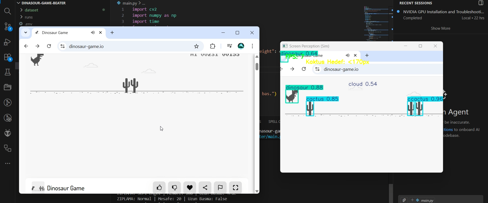

# 🦖 Chrome Dino Game AI Bot (YOLOv11)

An autonomous bot that plays the Chrome Dinosaur Game using real-time object detection. Powered by **YOLOv11**, **MSS** (for high-speed screen capture), and **Roboflow**.

  

## � Demo



## �🚀 Features
- **Real-time Object Detection:** Detects Cacti, Birds, and the Dino using YOLOv11 Nano.
- **High Performance:** Uses `mss` for screen capture (>60 FPS on Apple Silicon).
- **Smart Logic:** Calculates distance between Dino and obstacles to trigger jumps or ducks.
- **Local Training:** Custom dataset trained on Roboflow and exported for local GPU inference.

## 🛠️ Tech Stack
- **Python 3.9+**
- **Ultralytics YOLOv11** (Object Detection)
- **MSS** (Screen Capture)
- **PyAutoGUI** (Keyboard Control)
- **OpenCV** (Image Processing)
- **Roboflow** (Dataset Management)

---

## 📋 Prerequisites

- Python 3.9 or higher
- pip (Python package manager)
- macOS, Linux, or Windows
- GPU (optional, CPU works as well)

---

## ⚙️ Installation

### 1. Clone the Repository

\`\`\`bash
git clone <repository-url>
cd dinasour\ game\ beater
\`\`\`

### 3. Install Dependencies

First, install the general requirements:

\`\`\`bash
pip install --upgrade pip
pip install -r requirements.txt
\`\`\`

**Required Libraries:**
- `ultralytics` - YOLOv11 model
- `mss` - Screen capture
- `opencv-python` - Image processing
- `pyautogui` - Keyboard control
- `roboflow` - Dataset management
- `numpy` - Numerical operations
- `python-dotenv` - Environment variables

### 4. GPU Setup (Critical for NVIDIA Users) ⚡

⚠️ **IMPORTANT:** By default, pip might install the CPU-only version of PyTorch. If you have an NVIDIA GPU (RTX 30xx, 40xx, etc.), you **MUST** install the CUDA-supported version manually.

#### For NVIDIA GPU Users:

Uninstall the default CPU version:

\`\`\`bash
pip uninstall torch torchvision torchaudio -y
\`\`\`

Install the CUDA 12.1 version (Recommended):

\`\`\`bash
pip install torch torchvision torchaudio --index-url https://download.pytorch.org/whl/cu121
\`\`\`

**Alternative CUDA versions:**
- CUDA 11.8: `https://download.pytorch.org/whl/cu118`
- CPU only: Standard `pip install -r requirements.txt` is sufficient

#### For Apple Silicon (M1/M2/M3) & CPU Users:

Standard installation is usually sufficient. No extra steps needed.

---

### 5. Verify GPU Detection (Optional but Recommended)

Before training, verify that your GPU is properly detected. You have two options:

#### Option A: Using YOLO Checks Command (Recommended)

```bash
yolo checks
```

This command will automatically check:
- ✅ Python version and dependencies
- ✅ CUDA/GPU availability
- ✅ PyTorch and ultralytics versions
- ✅ System configuration

#### Option B: Using Custom GPU Check Script

Alternatively, you can use the custom GPU detection script:

```bash
python check_gpu.py
```

This script provides detailed information about:
- ✅ NVIDIA GPU (CUDA) availability
- ✅ Apple Silicon GPU (MPS) availability  
- ✅ GPU memory information
- ✅ Recommended device parameter for your hardware

**Expected Output for GPU Check:**

If NVIDIA GPU is detected:
```
✅ Use device parameter: device=0
   Example: yolo detect train ... device=0
```

If Apple Silicon (M Chip) is detected:
```
✅ Use device parameter: device=mps
   Example: yolo detect train ... device=mps
```

If no GPU is detected:
```
ℹ️  No GPU detected, falling back to CPU
   Use device parameter: device=cpu
```

---

## 🎓 Training the Model

### Dataset Preparation

The dataset is already located in the `dataset/` folder and managed via Roboflow.

\`\`\`bash
# (Optional) Download dataset from Roboflow
python get_dataset.py
\`\`\`

### Training Command

Train the YOLOv11 model using the following command:

\`\`\`bash
yolo detect train \
  data=dataset/data.yaml \
  model=train.pt \
  epochs=50 \
  imgsz=640 \
  device=mps
\`\`\`

**Command Parameters:**
- `data=dataset/data.yaml` - Dataset configuration file
- `model=train.pt` - Pre-trained model weights for training
- `epochs=50` - Number of training epochs
- `imgsz=640` - Input image size
- `device=mps` - Apple Silicon GPU usage (NVIDIA GPU: `0`, CPU: `cpu`)

**Device Parameter for Your Hardware:**
- Apple Silicon (M1/M2/M3): `device=mps`
- NVIDIA GPU: `device=0` (or GPU index number)
- CPU: `device=cpu`

### Device-Specific Training Commands

**M Chip:**
```bash
yolo detect train data=dataset/data.yaml model=train.pt epochs=50 imgsz=640 device=mps
```

**NVIDIA GPU:**
```bash
yolo detect train data=dataset/data.yaml model=train.pt epochs=50 imgsz=640 device=0
```

After training completes, the model is saved in `runs/detect/train/weights/best.pt`.

---

## 🎮 Running the Application

### Execute the Main Script

\`\`\`bash
python main.py
\`\`\`

**Usage:**
1. Open the Dino game in Chrome or Brave browser
2. Run the script
3. The bot will automatically play the game

### Screen Processing (For Adjustments)

To test screen processing parameters:

\`\`\`bash
python screen_processing.py
\`\`\`

---

## 📁 Project Structure

\`\`\`
dinasour game beater/
├── README.md                 # This file
├── requirements.txt          # Python dependencies
├── main.py                   # Main game bot script
├── screen_processing.py      # Screen capture processing
├── get_dataset.py           # Roboflow dataset downloader
├── training_command.txt      # Training commands reference
├── .env                      # Environment variables (git ignore)
├── .env.example              # Example environment variables
└── dataset/                  # Dataset files
    ├── data.yaml             # Dataset configuration
    ├── train/                # Training images
    └── val/                  # Validation images
\`\`\`

---

## 🔧 Troubleshooting

### GPU Detected as "None" or Running on CPU

If you have an NVIDIA GPU but `yolo checks` or `check_gpu.py` says `CUDA Available: False`:

**Step 1:** Check your PyTorch version
\`\`\`bash
python -c "import torch; print(torch.__version__)"
\`\`\`

If you see `+cpu` at the end (e.g., `2.10.0+cpu`), you have the wrong version.

**Step 2:** Reinstall PyTorch with CUDA support
\`\`\`bash
pip uninstall torch torchvision torchaudio -y
pip install torch torchvision torchaudio --index-url https://download.pytorch.org/whl/cu121
\`\`\`

**Step 3:** Verify the installation
\`\`\`bash
python check_gpu.py
# or
yolo checks
\`\`\`

### `ModuleNotFoundError: No module named 'ultralytics'`
\`\`\`bash
pip install --upgrade ultralytics
\`\`\`

### `ModuleNotFoundError: No module named 'mss'`
\`\`\`bash
pip install mss
\`\`\`

### Other Module Not Found Errors

Reinstall all dependencies:
\`\`\`bash
pip install --upgrade -r requirements.txt
\`\`\`

### Bot Not Playing the Game
- Check if Chrome DevTools is open (close it if it is)
- Ensure the game window is in focus and visible
- Test screen capture with `python screen_processing.py`
- Verify the model weights file exists at `runs/detect/train/weights/best.pt`

---

## 📝 License

This project is open source. See the LICENSE file for details.

---

## 💡 Tips

- Using a virtual environment prevents dependency conflicts
- GPU training is **50-100x faster** than CPU training
- Update your dataset regularly
- Adjust parameters in `screen_processing.py` if the game mechanics change